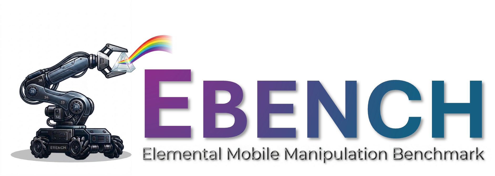

<div align="right">

English | [简体中文](README.zh-CN.md)

</div>

<div align="center">



# EBench: Elemental Mobile Manipulation Benchmark

**From a single success rate to a multi-axis capability profile.**
*Released by [Shanghai AI Laboratory](https://www.shlab.org.cn/).*

<p>
  <a href="https://internrobotics.github.io/EBench-doc/"></a>
  
  <a href="https://internrobotics.shlab.org.cn/eval"></a>
  <a href="LICENSE"></a>
</p>

<p>
  <a href="https://github.com/InternRobotics/GenManip"></a>
  <a href="https://github.com/InternRobotics/genmanip-client"></a>
</p>

<p>
  <a href="https://huggingface.co/datasets/InternRobotics/EBench-Assets"></a>
  <a href="https://huggingface.co/datasets/InternRobotics/EBench-Dataset"></a>
  
</p>

</div>

---

## What is EBench?

EBench is an indoor VLA manipulation benchmark built on NVIDIA Isaac Sim. Instead of compressing a model's behaviour into a single overall success rate, it produces a **multi-axis capability profile** that exposes *what* a model is good at — and where it overfits.

This repository is the **project entry point**. It hosts reference baselines and convenience scripts; the simulation runtime, the `gmp` CLI, and the datasets each live in their own repositories (linked in the badges above).

## What makes EBench different

- **Three manipulation regimes in one benchmark** — covers *long-horizon*, *dexterous & precise*, and *mobile* manipulation, regimes most benchmarks address in isolation.
- **5-axis atomic diagnostic** — every task is labelled by *Scene · Atomic Skill · Horizon · Precision · Mobility*, so a black-box score becomes a readable strength/weakness map.
- **4-axis generalization tests** — controlled perturbations along *Object · Background · Instruction · Mixed*, attributing OOD drops to a specific axis.
- **Strict train / test isolation** — `val_train` and `val_unseen` are open for tuning; the held-out `test` (Test-Mini) drives the leaderboard, so numbers reflect real generalization rather than fitting to the eval distribution.

Two evaluation tracks are exposed: **Specialist** (Tabletop or Mobile Manip) and **Generalist** (both at once).

For the full methodology, task taxonomy, and per-axis rationale, see the [project documentation](https://internrobotics.github.io/EBench-doc/).

## Project layout

EBench is split across a small constellation of repositories. **This repo** is the front door:

| Component | Where it lives | What it provides |
| --- | --- | --- |
| **EBench** (this repo) | [InternRobotics/EBench](https://github.com/InternRobotics/EBench) | Reference baselines, scripts, project entry point |
| **GenManip** | [InternRobotics/GenManip](https://github.com/InternRobotics/GenManip) | Isaac Sim evaluation server, task configs |
| **genmanip-client** | [InternRobotics/genmanip-client](https://github.com/InternRobotics/genmanip-client) | `gmp` CLI + `EvalClient` Python API |
| **EBench-Assets** | [🤗 EBench-Assets](https://huggingface.co/datasets/InternRobotics/EBench-Assets) | Scenes, objects, and task assets |
| **EBench-Dataset** | [🤗 EBench-Dataset](https://huggingface.co/datasets/InternRobotics/EBench-Dataset) | Training trajectories (LeRobot format) |
| **Docs site** | [internrobotics.github.io/EBench-doc](https://internrobotics.github.io/EBench-doc/) | Setup, evaluation workflow, CLI reference |
| **Online Challenge** | [internrobotics.shlab.org.cn/eval](https://internrobotics.shlab.org.cn/eval) | Remote evaluation, leaderboard, diagnostic reports |

```
EBench/
├── baselines/       # Reference policies (one sub-folder per baseline)
├── scripts/         # Evaluation and analysis scripts
├── assets/          # Static assets used by this README
├── LICENSE
└── README.md
```

## Quickstart

EBench runs as a client–server system. The server runs Isaac Sim; the client (`gmp` CLI) is a tiny package that drops into your model's Python environment.

```bash
# 1. Bring up the server  →  see Environment Setup
#    https://internrobotics.github.io/EBench-doc/getting-started/environment/

# 2. Install the client in your model env
git clone https://github.com/InternRobotics/genmanip-client.git
cd genmanip-client && pip install -e .

# 3. Run an evaluation
gmp submit ebench/generalist/test --run_id my_first_run
gmp eval  -a r5a -g lift2 --worker_ids 0
gmp status
```

A full validation pass takes roughly **30 minutes on 8× RTX 4090**. Detailed setup, asset download, and the complete `gmp` reference are in the [docs site](https://internrobotics.github.io/EBench-doc/).

## Tasks

**26 task types** across *Long-Horizon*, *Pick-and-Place*, and *Dexterous & Precise*, expanded with the four generalization axes and three splits into **794 evaluation task instances**. Browse the video gallery at [Task Showcase](https://internrobotics.github.io/EBench-doc/evaluation/task-showcase/).

## Baselines

Reference policies live under `baselines/<name>/`, each with its own README and a `gmp eval`-compatible entry point. EBench has been validated on **π0**, **π0.5**, **X-VLA**, and **InternVLA-A1** — see the [leaderboard](https://internrobotics.shlab.org.cn/eval) for current standings and per-axis diagnostic reports.

Each baseline ships its upstream code as a `third_party/` git submodule and layers an EBench-specific entry point on top. Initialize the submodules first:

```bash
git submodule update --init --recursive
```

### openpi (π0 / π0.5)

Submodule lives at `baselines/openpi/third_party/openpi`; EBench-specific configs and the eval client are layered under `baselines/openpi/{src,scripts}/`. See [`baselines/openpi/README.md`](baselines/openpi/README.md) for the full walkthrough.

The post-trained OpenPI models on EBench are available at:

- [π0.5 EBench Generalist](https://huggingface.co/william-g/pi05-ebench-generalist/tree/main)
- [π0 EBench Generalist](https://huggingface.co/william-g/pi0-ebench-generalist/tree/main)

```bash
# After configuring paths/tokens in scripts/launch_pi_onlineeval.sh:
bash scripts/launch_pi_onlineeval.sh
```

### X-VLA

```bash
# 1. Install deps
pip install -r baselines/X-VLA/requirements.txt

# 2. Run eval (each WORKER_ID is a separate inference worker)
MODEL_PATH=/path/to/xvla \
BASE_URL=https://internrobotics.shlab.org.cn/eval \
RUN_ID=my_first_run \
TOKEN=<your-token> \
WORKER_IDS=0 \
  bash scripts/run_xvla_eval.sh
```

### InternVLA-A1

Submodule lives at `baselines/InternVLA-A1/third_party/InternVLA-A1`. See [`baselines/InternVLA-A1/README.md`](baselines/InternVLA-A1/README.md) for the full walkthrough.

```bash
# 1. Install upstream deps from third_party/InternVLA-A1/README.md
# 2. Pull the checkpoint
huggingface-cli download hxma/EBench-Generalist-InternVLA-A1 \
  --repo-type model \
  --local-dir baselines/InternVLA-A1/checkpoints/EBench-Generalist-InternVLA-A1

# 3. Run eval
cd baselines/InternVLA-A1 && bash eval_pjsim.sh
```

To plug your own model in, follow the contract documented at [Integrate Your Own Model](https://internrobotics.github.io/EBench-doc/evaluation/custom-model/).

## Online challenge

The 24/7 evaluation platform at [internrobotics.shlab.org.cn/eval](https://internrobotics.shlab.org.cn/eval) runs every submission on the held-out Test-Mini split and produces an automatic diagnostic report (capability radar, validation→test transfer curve, generalization radar, task heatmap). Submission flow: see the [Challenge](https://internrobotics.github.io/EBench-doc/challenge/) page.

## Citation

A preprint is forthcoming. In the meantime:

```bibtex
@misc{ebench2026,
  title  = {EBench: Elemental Mobile Manipulation Benchmark},
  author = {Shanghai AI Laboratory},
  year   = {2026},
  note   = {Preprint coming soon},
  url    = {https://internrobotics.github.io/EBench-doc/}
}
```

## License

MIT — see [LICENSE](LICENSE). Built on [NVIDIA Isaac Sim](https://developer.nvidia.com/isaac/sim), [cuRobo](https://github.com/NVlabs/curobo), and the [LeRobot](https://github.com/huggingface/lerobot) data format. Issues and pull requests are welcome.
